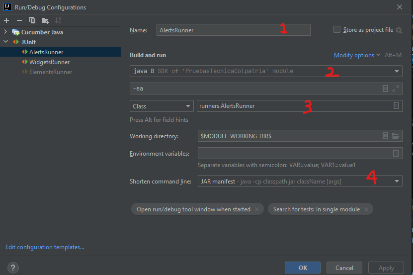
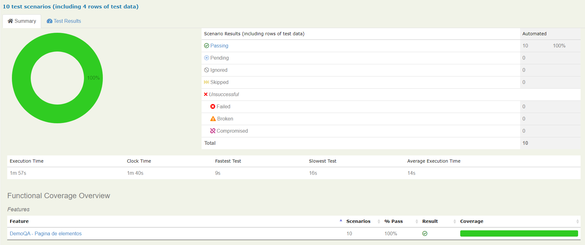
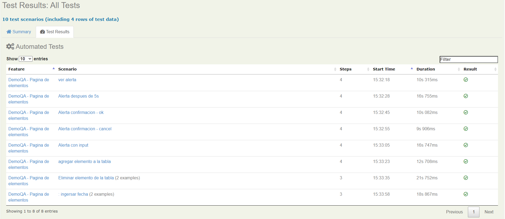

# PruebaTecnicaColpatria
  Este proyecto es la solución de la prueba técnica propuesta por la empresa Sophos - Colpatria

## Comenzando
Estas instrucciones te permitirán clonar el proyecto y realizar la configuración adecuada 
para que tengas el proyecto en funcionamiento en tu máquina local para propósitos de desarrollo y pruebas.

### Pre-Requisitos
Como pre-requisitos deberás tener instalados las siguientes herramientas:
1. Git
2. Java
3. Gradle 6.8.3
4. Intellij o el IDE que prefieras
5. Tener instalado el plugin de cucumber en el IDE
6. la version del chrome driver es  92.0.4515.159

## Instalación
1. Abre una ventana de comandos
2. Ejecuta el comando java -version
3. Ejecuta el comando mvn -version
4. Verifica las versiones
5. Clona el respositorio
   Git:
    - git clone https://github.com/yorman67/PruebaTecnicaColpatria.git
    - cd PruebaTecnicaColpatria
6. Espera que todas las dependencias necesarias se descarguen

## Ejecución de pruebas
En la carpeta  runners encontrarás el runner especifico de cada uno de los escenarios.

### Ejecucion con JUnit
      Si quieres ejecutar las pruebas con JUnit, sigue estos pasos

### Ejecucion con  Maven
      Podrás ejecutar las pruebas con maven para generar los resportes de serenity solo ejecutando el siguiente comando

      - mvn clean test verify
### Evidencia

    

### Construido con
Este proyecto fue construido con:

    * serenity Bdd 
    * patrón Screenplay 
    * Maven
    * java
    * cucumber

### Autor
- Yorman Paúl Martínez Acevedo

### Agradecimiento
Quiero dar las gracias a Sophos y a colpatria por permitirme participar en su proceso de selección, con este ejercicio tuve la oportunidad de practicar y mejorar mis habilidades y espero poder tener una retroalimentación por parte de esta gran compañía, nuevamente muchas gracias.
